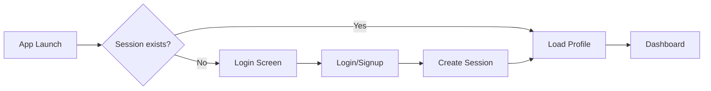

# SUSTAINAI - Flutter
<!-- SustainAI --> 
<div align="center">


**A comprehensive sustainability platform built with Flutter and Supabase**

*Recreating the React version with identical UI/UX and functionality*

[Features](#-features) • [Getting Started](#-getting-started) • [Screenshots](#-screenshots) • [Documentation](#-project-structure)

</div>

---

## 🌱 Overview

SUSTAINAI is a comprehensive sustainability platform implemented in Flutter with Supabase as the backend. This repository recreates the React version's UI/UX and functionality in a native Flutter application.

### Key Points

- 📱 Cross-platform Flutter application (Android, iOS, Web, Desktop)
- 🔐 Supabase backend for authentication, storage, and database
- 🎯 Modular design with six sustainability modules and a unified dashboard
- 🎨 Modern UI with Material Design 3 and custom theming
- 🚀 Production-ready with proper state management and routing

---

## ✨ Features

### 🔐 Authentication
- Login & signup using email/password
- Session management via Supabase Auth
- User profiles with full name and metadata
- Protected routes for authenticated users

### 📊 Dashboard & Modules

**6 Sustainability Modules:**

1. **🛒 Sustainable Consumption** - Analyze environmental impact of daily habits
2. **💰 Financial Integrity** - Track ethical investments and sustainable funding
3. **📈 Sustainability Monitor** - Real-time carbon footprint tracking
4. **💚 Personal Wellbeing** - Holistic wellness tracking
5. **🌍 Climate Resilience** - Disaster preparedness and weather prediction
6. **⚡ ESG Analysis** - Energy optimization with ESG metrics

**Platform Overview Metrics:**
- Total Modules Available
- Active Analyses Running
- Sustainability Score
- Weekly Alerts Generated

### 🎨 Design System

- Modern UI matching the React version
- Light & dark themes with Material Design 3
- Custom color palette with teal as primary color
- Google Fonts (Inter) for typography
- Responsive layouts for mobile and tablet
- Glass-morphism effects on auth screens
- Gradient backgrounds and shadows

---

## 🛠️ Tech Stack

| Category | Technology |
|----------|-----------|
| **Framework** | Flutter (cross-platform UI) |
| **Language** | Dart |
| **Backend** | Supabase (Auth, Database, Storage) |
| **State Management** | Provider |
| **Navigation** | go_router |
| **Charts** | fl_chart |
| **Fonts** | Google Fonts (Inter) |

---

## 🚀 Getting Started

### Prerequisites

- Flutter SDK (3.0.0 or higher)
- Dart SDK (3.0.0 or higher)
- Supabase account and project

### Installation

1. **Clone the repository**

   ```bash
   git clone https://github.com/Dhilipkumar-max/Sustain_AI.git
   cd sustainai_flutter
   ```

2. **Install dependencies**

   ```bash
   flutter pub get
   ```

3. **Configure Supabase**

   The app ships with a configuration file at `lib/core/config/app_config.dart`
   
   - Supabase URL used in this project: `https://jgorlakedcrfnboolftb.supabase.co`
   - To use your own Supabase project, update the credentials in `app_config.dart`

4. **Run the app**

   ```bash
   flutter run
   ```

---

## 📁 Project Structure

```
lib/
├── core/
│   ├── config/
│   │   └── app_config.dart          # App configuration & Supabase credentials
│   ├── services/
│   │   └── supabase_service.dart    # Supabase client service
│   └── theme/
│       └── app_theme.dart           # Theme configuration (light/dark)
│
├── features/
│   ├── auth/
│   │   ├── models/
│   │   │   └── profile_model.dart   # User profile model
│   │   ├── providers/
│   │   │   └── auth_provider.dart   # Authentication state management
│   │   └── screens/
│   │       ├── login_screen.dart    # Login page
│   │       └── signup_screen.dart   # Signup page
│   │
│   ├── dashboard/
│   │   └── screens/
│   │       └── dashboard_screen.dart # Main dashboard with modules
│   │
│   ├── settings/
│   │   └── screens/
│   │       └── settings_screen.dart  # Settings & profile
│   │
│   ├── consumption/                  # Consumption feature
│   ├── financial_integrity/          # Financial module
│   ├── monitor/                      # Monitoring module
│   ├── predictive/                   # Predictive analytics
│   ├── resilience/                   # Climate resilience
│   └── wellbeing/                    # Wellbeing module
│
└── main.dart                         # App entry point & routing
```

---

## 🎨 Design System

### Color Palette

| Color | Hex | Usage |
|-------|-----|-------|
| **Primary (Teal)** | `#14b8a6` | Main brand color, sustainability theme |
| **Success** | `#22c55e` | Positive actions, achievements |
| **Warning** | `#f59e0b` | Alerts, cautions |
| **Danger** | `#ef4444` | Errors, critical actions |
| **Info** | `#3b82f6` | Information, tips |

### Typography

- **Font Family**: Inter (Google Fonts)
- **Heading 1**: 42px, weight 800
- **Heading 2**: 24px, weight 700
- **Body**: 16px, weight 400

### Spacing Scale

```dart
space1: 4px
space2: 8px
space3: 12px
space4: 16px
space6: 24px
space8: 32px
```

---

## 🗄️ Database Schema

The app uses the same Supabase database schema as the React version:

### Tables

| Table | Description |
|-------|-------------|
| `profiles` | User profiles and preferences |
| `products` | Sustainable product database |
| `consumption_logs` | User consumption tracking |
| `wellbeing_assessments` | Health and wellness data |
| `disaster_alerts` | Climate and disaster warnings |
| `companies` | Company ESG data |
| `user_portfolios` | Investment portfolios |
| `esg_alerts` | ESG-related notifications |

---

## 📦 Dependencies

```yaml
dependencies:
  supabase_flutter: ^2.5.6      # Supabase client
  provider: ^6.1.2              # State management
  google_fonts: ^6.2.1          # Typography
  flutter_svg: ^2.0.10+1        # SVG support
  fl_chart: ^0.68.0             # Charts
  intl: ^0.19.0                 # Internationalization
  http: ^1.2.1                  # HTTP client
  shared_preferences: ^2.2.3    # Local storage
  go_router: ^14.2.0            # Navigation
```

---

## 🔐 Authentication Flow



1. **App Launch** → Check for existing session
2. **If authenticated** → Navigate to Dashboard
3. **If not authenticated** → Show Login screen
4. **Login/Signup** → Create session with Supabase
5. **Fetch user profile** → Load from profiles table
6. **Navigate to Dashboard** → Show all modules

---

## 🌟 Feature Comparison

| Feature | React Version | Flutter Version |
|---------|:-------------:|:---------------:|
| Authentication | ✅ Supabase Auth | ✅ Supabase Auth |
| Dashboard UI | ✅ Modern Design | ✅ Identical Design |
| Module Navigation | ✅ 6 Modules | ✅ 6 Modules |
| Light/Dark Theme | ✅ CSS Variables | ✅ ThemeData |
| Protected Routes | ✅ React Router | ✅ Navigator |
| State Management | ✅ Context API | ✅ Provider |
| Responsive Design | ✅ CSS Grid | ✅ GridView |

---

## 🚧 Module Status

| Module | Status | Description |
|--------|--------|-------------|
| ✅ Authentication | Complete | Full auth flow with Supabase |
| ✅ Dashboard | Complete | Main dashboard with metrics |
| ✅ Settings | Complete | User settings and profile |
| 🚧 Consumption | Coming Soon | Environmental impact tracking |
| 🚧 Financial Integrity | Coming Soon | Ethical investment tracking |
| 🚧 Wellbeing | Coming Soon | Wellness tracking |
| 🚧 Climate Resilience | Coming Soon | Disaster preparedness |
| 🚧 ESG Analysis | Coming Soon | Energy optimization |
| 🚧 Sustainability Monitor | Coming Soon | Carbon footprint tracking |

---

## 📱 Screenshots

### Main Dashboard


### Module 1 — Sustainable Consumption

<div align="center">
  
  
  
</div>

### Module 2 — Financial Integrity

.jpg)

### Module 3 — Sustainability Monitor

.jpg)

### Module 4 — Personal Wellbeing

<div align="center">
  
  
</div>

### Module 5 — Climate Resilience

<div align="center">
  
  
  
</div>

### Module 6 — ESG Analysis


---

## 📲 Download

Scan the QR code to download the app:

<div align="center">
  
</div>

---

## 🔧 Development

### Run in Debug Mode

```bash
flutter run
```

### Build for Production

**Android:**
```bash
flutter build apk --release
```

**iOS:**
```bash
flutter build ios --release
```

**Web:**
```bash
flutter build web --release
```

**Desktop (Windows/macOS/Linux):**
```bash
flutter build windows --release
flutter build macos --release
flutter build linux --release
```

---

## 🤝 Contributing

This repository is a Flutter recreation of the React SustainAI app. Contributions are welcome!

### What We Share

- Supabase backend
- Identical database schema
- Matching UI/UX design
- Similar feature set

### How to Contribute

1. **Fork the repository**
2. **Create a feature branch**
   ```bash
   git checkout -b feature/amazing-feature
   ```
3. **Commit your changes**
   ```bash
   git commit -m 'Add some amazing feature'
   ```
4. **Push to the branch**
   ```bash
   git push origin feature/amazing-feature
   ```
5. **Open a Pull Request**

---

## 🔒 Security & Secrets

⚠️ **Important:** Remove any Supabase credentials or secrets from commits before publishing.

- `lib/core/config/app_config.dart` contains configuration used by the app
- Consider using environment variables or CI secrets instead of committing credentials
- Never commit API keys, passwords, or sensitive data to version control

---

## 📄 License

Copyright © 2024 SustainAI Inc. All rights reserved.

---

## 🙏 Acknowledgments

- Built with [Flutter](https://flutter.dev/) 💙
- Powered by [Supabase](https://supabase.com/) 🚀
- Inspired by the React version of SustainAI

---

<div align="center">

**Powering a more sustainable tomorrow** 🌱

Made with ❤️ by the SUSTAINAI Team

[⬆ Back to Top](#sustainai---flutter)

</div>

